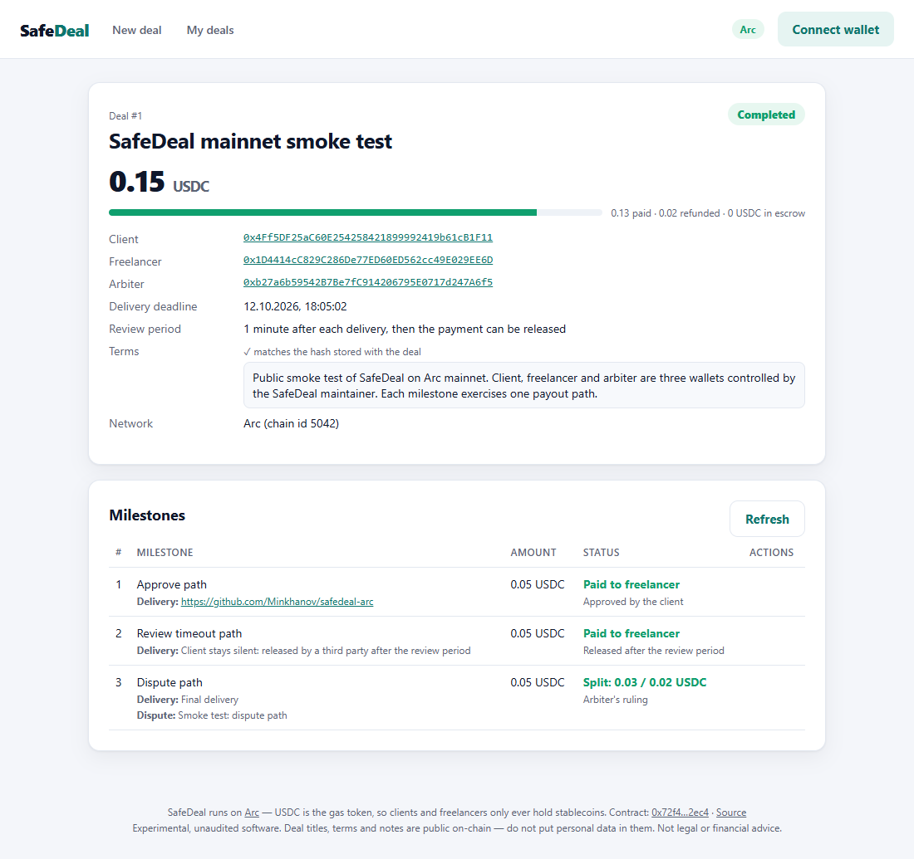
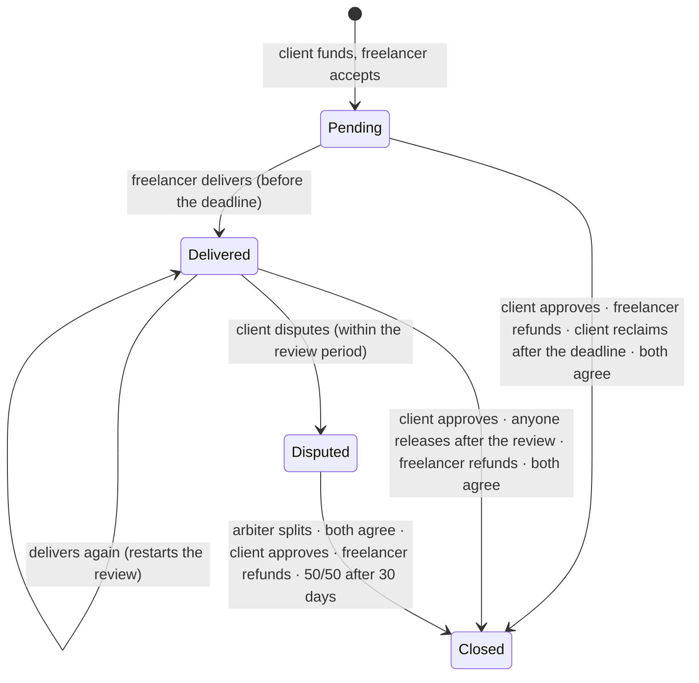
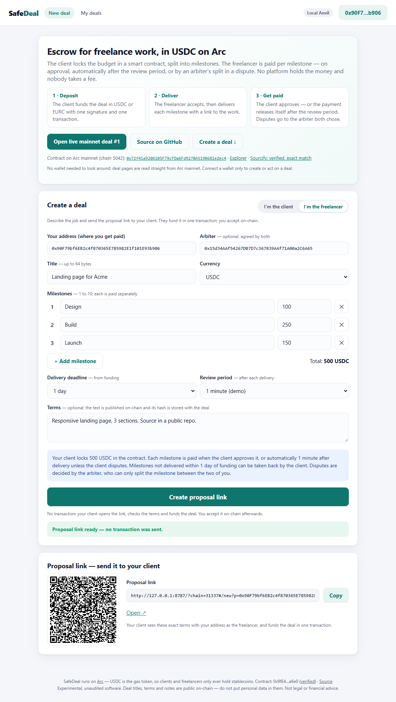
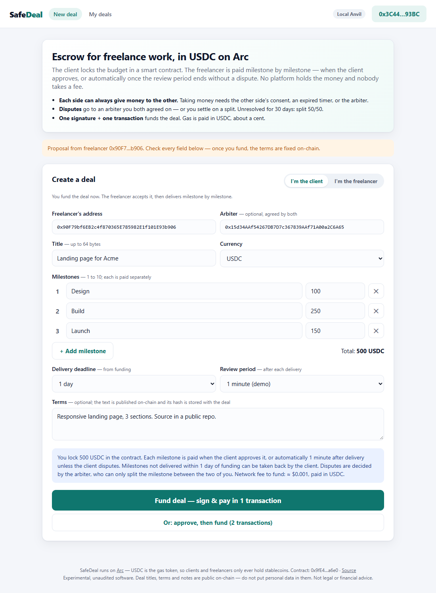
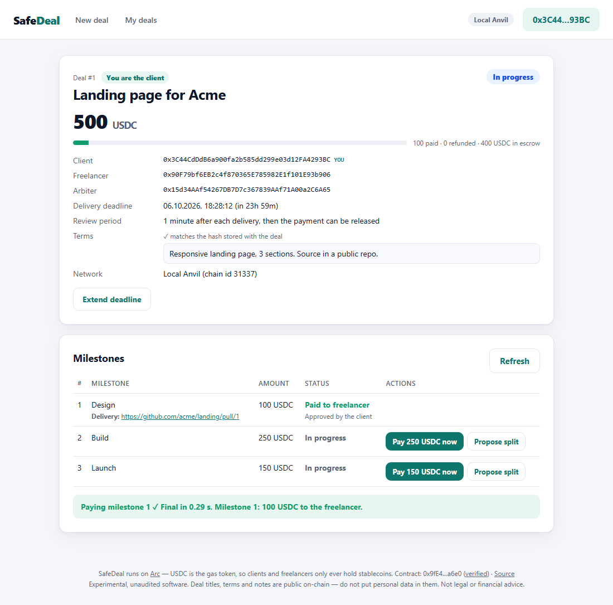
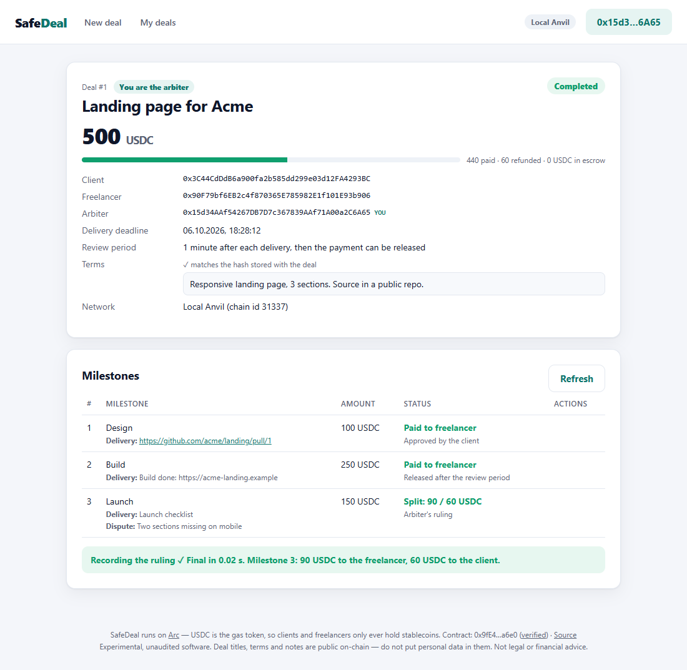
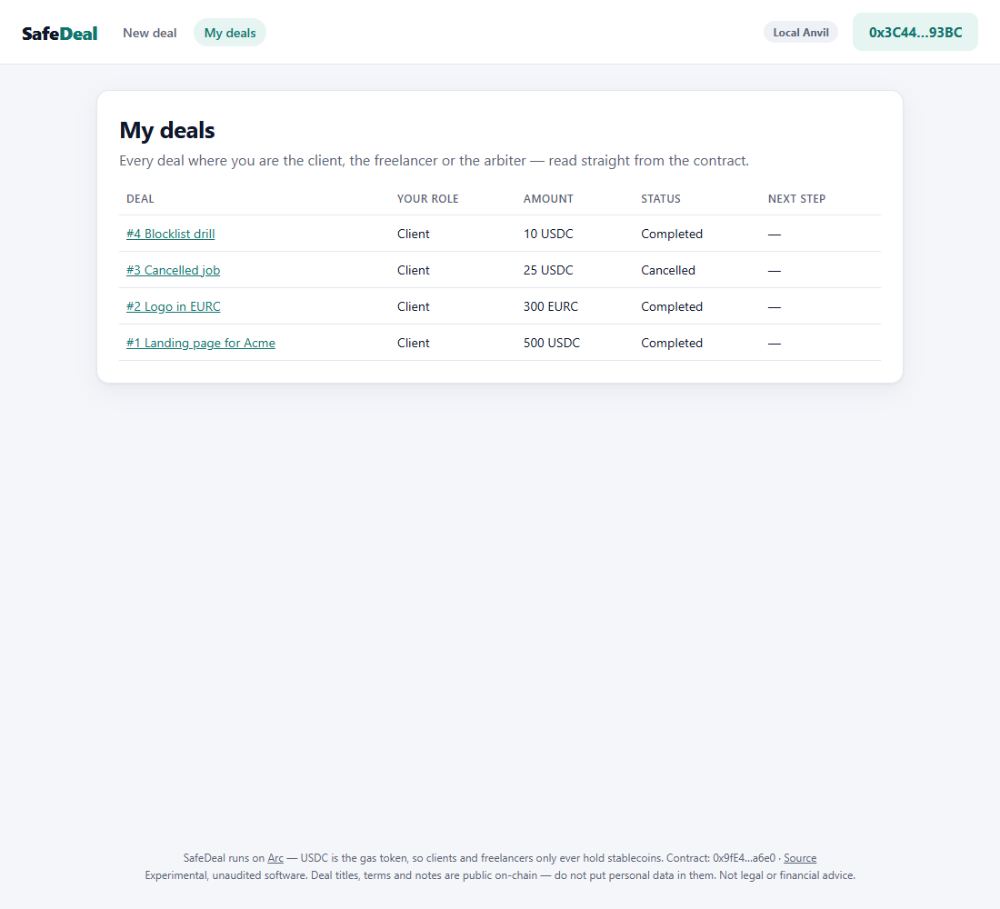

# SafeDeal — milestone escrow for freelance work, in USDC on Arc

[](https://github.com/Minkhanov/safedeal-arc/actions/workflows/test.yml)

SafeDeal lets a client and a freelancer do business without trusting each other or a platform. The client
locks the budget in a smart contract, split into milestones. The freelancer accepts the deal, delivers each
milestone and gets paid when the client approves it — or automatically once the review period ends without a
dispute. Disputes go to an arbiter both sides chose up front, or are settled by agreement. There is no
platform account, no custody by us, and no fee.

| | |
|---|---|
| **Live app** | [minkhanov.github.io/safedeal-arc](https://minkhanov.github.io/safedeal-arc/) |
| **Contract (Arc mainnet, chain 5042)** | [`0x72f41a9206105F79cFDa6Fd9270A519B681e2ec4`](https://explorer.arc.io/address/0x72f41a9206105F79cFDa6Fd9270A519B681e2ec4) · source verified on [Sourcify](https://sourcify.dev/#/lookup/0x72f41a9206105F79cFDa6Fd9270A519B681e2ec4) (exact match, runtime + creation) |
| **A real deal on mainnet** | [Deal #1](https://minkhanov.github.io/safedeal-arc/#/deal/1) — funded with one transaction, then paid out through all three paths (approval, review timeout, arbiter ruling). Transactions are [listed below](#live-on-arc-mainnet). |
| **Currencies** | Arc's native USDC (ERC-20 interface `0x3600…0000`) and EURC `0xbEf5…21c1`, both 6 decimals |
| **Status** | Experimental. Unaudited. Please use small amounts. |



## The rule behind every function

> **Each side can always give money to the other on its own. Taking money needs the other side's consent,
> an expired timer, or the arbiter.**

| Who | Can do alone | Effect |
|---|---|---|
| Client | `approveMilestone` | pay a milestone to the freelancer (at any time, even before delivery or during a dispute) |
| Client | `extendDeadline` | give the freelancer more time (only later, never earlier) |
| Client | `cancel` | get everything back — **only before the freelancer accepts** |
| Freelancer | `refund` | send a milestone back to the client |
| Freelancer | `decline` | refuse an unaccepted deal; the client gets everything back |
| Anyone | `releaseAfterReview` | pay a delivered milestone to the freelancer once the review period has passed without a dispute |
| Client | `reclaimAfterDeadline` | take back a milestone that was **never delivered** by the deadline |
| Client | `dispute` | stop the review timer on a delivery (only during the review period) |
| Arbiter | `resolve` | split a **disputed** milestone between client and freelancer — never anywhere else |
| Anyone | `resolveAfterTimeout` | split a dispute 50/50 if nobody resolved it within 30 days |
| Both | `proposeSettlement` | when both propose the same split, the milestone is paid out at once |

Deals can be made **without an arbiter**. Then a dispute can only end in a split both sides agree on, or
50/50 after 30 days. That is a deterrent against bad faith on both sides, with nobody to trust.

## How a milestone moves



Every milestone ends in `Closed`, with the resolution and the freelancer's share stored on-chain. When the last
milestone closes, the deal is `Closed`. No path leaves money stuck, unless a party loses its keys.

## Demo

Demo video (88 s): https://minkhanov.github.io/safedeal-arc/media/safedeal_demo.mp4 —
[English subtitles](https://minkhanov.github.io/safedeal-arc/media/safedeal_demo.en.srt).

Screenshots from the automated browser run on a local devnet (`e2e/test_e2e.py`):

| Freelancer writes a proposal (no tx) | Client checks it and funds (1 tx) | Client approves milestone 1 |
|---|---|---|
|  |  |  |

| Arbiter rules on a dispute | My deals |
|---|---|
|  |  |

## What it uses Arc for

- **Only stablecoins, ever.** Gas on Arc is paid in USDC, so a freelancer who has never touched crypto can
  receive, hold and spend USDC without a second token. Both sides see the network fee in dollars before they sign.
- **USDC and EURC are native.** The same deal code takes either one; a European client can fund in EURC.
  The app reads both token addresses from the contract.
- **One transaction to fund.** The client signs an EIP-2612 permit (free) and sends one transaction that sets
  the allowance, creates the deal and locks the money. Before asking for the signature, the app checks the token's
  on-chain EIP-712 domain (`USDC`/`EURC`, version `2`). Fork tests confirm it on mainnet and testnet.
- **Deterministic finality.** A delivery, an approval or a ruling is final at its first receipt, so the freelancer
  can treat "paid" as paid. The UI shows the time to finality.
- **Arc-aware contract design** (following Arc's [porting guide](https://docs.arc.io/arc/tutorials/porting-contracts-to-arc)):
  - Funds are tracked in internal accounting (`totalLocked`, `totalClaimable`), never with `balanceOf`. Arc's
    ERC-20 view of native USDC truncates, and anyone can send extra USDC to a contract. Solvency is checkable
    on-chain: `balanceOf(SafeDeal) ≥ totalLocked + totalClaimable`.
  - **Blocklist-safe payouts.** On Arc a transfer to a blocklisted address reverts. If a payout is rejected, it is
    credited to the recipient for a later `withdraw()` instead of reverting. One blocked party can therefore never
    freeze the other party's refund or payment. Credits can only be withdrawn **by the same address**, so Circle's
    blocklist cannot be bypassed through SafeDeal.
  - A payout that fails because the caller starved it of gas reverts the whole transaction (`InsufficientGas`).
    Nobody can force a deferral just to annoy the recipient.
  - No `payable` functions and no native-value paths, so ERC-20 allowances are a complete spending bound.
  - Delivery notes, dispute reasons and the full terms live in event logs; the contract stores each one's block
    number, so the app reads a single block instead of scanning ranges (Arc's public RPC caps `eth_getLogs`).
    The front end also retries batch items that the public RPC rate-limits (`-32005`).

## Live on Arc mainnet

[`scripts/smoke.py`](scripts/smoke.py) ran one deal through every payout path on Arc mainnet on 5 Oct 2026, with
three wallets controlled by the maintainer (0.05 USDC per milestone). The full log is in
[`docs/mainnet-smoke.json`](docs/mainnet-smoke.json).

| Step | Gas | Cost at 20 gwei | Transaction |
|---|---:|---:|---|
| Deploy `SafeDeal` | 3,483,995 | $0.070 | [`0xe60a2d74…`](https://explorer.arc.io/tx/0xe60a2d74624c52da996eb5a4b008b31d4e659bee164ae51b73f2b46ecd522a91) |
| `createDealWithPermit` — 3 milestones + terms, **one tx** | 588,515 | $0.0118 | [`0xbe4f98e7…`](https://explorer.arc.io/tx/0xbe4f98e76f15e89a57518d4eaede1983b403f17686816ddc39f25b54450d12e4) |
| `accept` (freelancer) | 30,487 | $0.0006 | [`0x06ecc072…`](https://explorer.arc.io/tx/0x06ecc072e5947fe20f279e33c4e6b23107ea08d99e79a996b4c0f5707c058c81) |
| `deliver` milestone 1 | 62,687 | $0.0013 | [`0xcc5534db…`](https://explorer.arc.io/tx/0xcc5534dbae1575f1930c371177ebf4816c9a243c04f3927738497e4633e2408d) |
| `approveMilestone` 1 (client) | 92,150 | $0.0018 | [`0xe3b7deba…`](https://explorer.arc.io/tx/0xe3b7deba18977b3f904d99bf7e56d2b5b9f6fe399692b3381afb2b31cfa9f154) |
| `deliver` milestone 2 | 63,437 | $0.0013 | [`0x3aadcf9c…`](https://explorer.arc.io/tx/0x3aadcf9ca46e93d46b4b687aab405e3fb7f49d3141e9125d54320b2036ceb0b3) |
| `releaseAfterReview` 2 (third party, after 60 s) | 92,395 | $0.0018 | [`0xe29445bb…`](https://explorer.arc.io/tx/0xe29445bbb2a5c8d311c6b694cddd32eaaf16b56c77ec8d03c8373d91ddf32ef8) |
| `deliver` milestone 3 | 61,985 | $0.0012 | [`0x26146982…`](https://explorer.arc.io/tx/0x26146982ddf9f0b781460ccc0df93bec01cfb23181ea5efbc2fc48dbba1e5b9e) |
| `dispute` 3 (client) | 45,254 | $0.0009 | [`0x1b3464e1…`](https://explorer.arc.io/tx/0x1b3464e15dc442c0dfde6c26f709c93f8bff42fbcd113caa3cf1388477be45f5) |
| `resolve` 3 (arbiter, 60/40 split) | 108,330 | $0.0022 | [`0x78c3ccb7…`](https://explorer.arc.io/tx/0x78c3ccb7841de26a3ec0a674bb6e8242e8a019a1f55fb8d102ad88f473289cf1) |

A full three-milestone deal costs about **2.3 cents** in total for both sides, including the dispute.

## Engineering

| Check | What it covers |
|---|---|
| **47 unit + fuzz tests** (`test/SafeDeal.t.sol`, 1,000 fuzz runs each) | every function and revert, permit + front-running, EURC, timers at their exact boundaries, splits, settlement matching, blocklisted payouts and withdrawals, gas starvation |
| **3 invariants** (`test/SafeDealInvariant.t.sol`, 256 runs × depth 64) | escrow balance == locked + claimable; tokens conserved; per-deal bookkeeping (locked == open milestones, statuses, splits ≤ amount). A handler drives all 17 actions with random actors, time jumps and blocklist toggles. |
| **Deterministic 10,000-step walk** | proves the handler reaches every action (create, accept, cancel, decline, deliver, approve, release, refund, reclaim, dispute, resolve, timeout, settle, withdraw offer, extend, blocklist, withdraw) and re-checks the invariants |
| **25/25 hand-written mutants killed** (`scripts/mutate.py`) | double pay, missing access checks, off-by-one timers, stale offers, unbounded splits, missing deferral, no gas guard, … each one makes a test fail |
| **2 fork tests** (`test/ArcFork.t.sol`) | the real USDC and EURC on Arc mainnet and testnet: 6 decimals, the permit domain the app signs with, deployment against the real tokens |
| **Browser end-to-end test** (`e2e/test_e2e.py`, anvil + Playwright + EIP-1193 shim) | 4 deals through the real UI: proposal link without a tx → fund with 1 tx → accept → approve → release by a stranger → dispute → arbiter ruling; EURC deal via approve + fund, split by agreement, reclaim after deadline; cancel; blocklisted freelancer → deferred payout → withdraw |
| **Mainnet smoke test** (`scripts/smoke.py`) | the same contract on Arc mainnet, all three payout paths, every receipt checked |

The contract has no owner, no fee, no upgrade path and no dependencies: about 660 lines, NatSpec included. The front end
is plain HTML/JS with ethers v6 vendored: no build step and no backend, hosted on GitHub Pages. CI runs format, build,
tests, mutants, fork tests and the e2e suite.

## Run it locally

Requirements: [Foundry](https://getfoundry.sh) and Python 3.10+ (for the e2e and mutation scripts).

```bash
git clone --recursive https://github.com/Minkhanov/safedeal-arc && cd safedeal-arc
forge test                                    # 47 unit/fuzz + invariant suite (fork tests skip without a fork)
forge test --match-contract ArcFork --fork-url https://rpc.mainnet.arc.io   # read-only checks vs real USDC/EURC
python scripts/mutate.py                      # 25 mutants, all must be killed
pip install -r e2e/requirements.txt && python -m playwright install chromium
python e2e/test_e2e.py                        # full flow in a real browser on local anvil
```

Standard Foundry can read Arc's USDC on a fork but cannot execute native-USDC transfers, because they go through an
Arc precompile. That is why payouts are tested with a mock that copies FiatToken's interface, revert strings,
blocklist and permit domain, and why the smoke test runs on mainnet itself. For runtime-accurate local testing, see
[Arc Foundry](https://github.com/circlefin/arc-foundry).

## Deploy and smoke-test

```bash
cp .env.example .env     # deployer key goes into .env (never commit it)
source .env
forge script script/Deploy.s.sol:Deploy --rpc-url arc --private-key $PRIVATE_KEY --broadcast
forge verify-contract <ADDRESS> src/SafeDeal.sol:SafeDeal --chain-id 5042 --verifier sourcify \
  --constructor-args $(cast abi-encode "constructor(address,address)" \
  0x3600000000000000000000000000000000000000 0xbEf5f6d51CB62b58e6A8f77868681825C6fe21c1)
# three wallets you control; the script tops up gas for the other two and sweeps it back with --sweep
CLIENT_KEY=... PROVIDER_KEY=... ARBITER_KEY=... SAFEDEAL=<ADDRESS> python scripts/smoke.py --sweep
```

Put the address into `web/config.js` (`networks[5042].safeDeal`) and push; the `pages` workflow publishes `web/`.

## Security notes and limitations

- **Unaudited prototype.** Use small amounts.
- **The arbiter is trusted to be fair**, but it can only split a disputed milestone between the two parties. It can never
  take funds or send them elsewhere, and it never touches undisputed milestones. Arbiter fees, if any, are agreed
  off-chain.
- **No arbiter means "agree or split 50/50 after 30 days".** This is deliberate, but it means a bad-faith client can
  delay half of a payment by disputing. Choose an arbiter for larger deals.
- **Everything in a deal is public**: title, terms, milestone names, delivery notes and dispute reasons are on-chain.
  Do not put personal data or confidential material in them. Link to private storage instead.
- **Blocklist behaviour.** The deferred-payout path relies on Arc reverting a blocklisted ERC-20 transfer inside the
  call, which the contract then catches. That matches Arc's documentation and is covered by tests with a
  FiatToken-like mock. It has not been exercised with a real blocklisted address on mainnet.
- Timers use `block.timestamp`. Periods are minutes to months, so proposer clock skew of a second does not matter.

## Related work

Circle's [Refund Protocol](https://www.circle.com/blog/refund-protocol-non-custodial-dispute-resolution-for-stablecoin-payments)
adds arbiter-mediated refunds to merchant payments. SafeDeal targets two-sided **work agreements** instead: milestones,
delivery deadlines, review periods, mutual settlement and an optional arbiter.

## Roadmap

- Signed proposals (EIP-712): the freelancer signs the offer off-chain, so the deal starts accepted in the client's
  single transaction
- Optional on-chain arbiter fee, agreed at creation, and 2-of-3 arbiter panels
- Funding from other chains with Circle's App Kit / CCTP, so a client can pay from USDC on another network
- Deal templates and e-mail/webhook notifications for the freelancer and the client

## Project layout

```
src/SafeDeal.sol                 contract
test/SafeDeal.t.sol              unit + fuzz tests
test/SafeDealInvariant.t.sol     invariant suite (handler with 17 actions) + deterministic coverage walk
test/ArcFork.t.sol               read-only checks against the real Arc USDC and EURC
test/mocks/                      FiatToken-like mock (permit, blocklist) and a gas-burning token for one test
script/Deploy.s.sol              Arc deployment (USDC 0x3600…0000, EURC per network)
script/DeployLocal.s.sol         anvil deployment with mock USDC/EURC
scripts/smoke.py                 live smoke test with cast (used on mainnet)
scripts/mutate.py                hand-written mutation testing
web/                             static front end (index.html, app.js, config.js, vendored ethers + QR lib)
e2e/                             browser end-to-end test (anvil + Playwright + EIP-1193 shim)
docs/                            screenshots and the mainnet smoke-test log
.github/workflows/               CI (tests, mutants, fork, e2e) and GitHub Pages deployment
```

## License

MIT. Third-party files in `web/vendor/` keep their own MIT licenses (see `web/vendor/LICENSES.md`).
